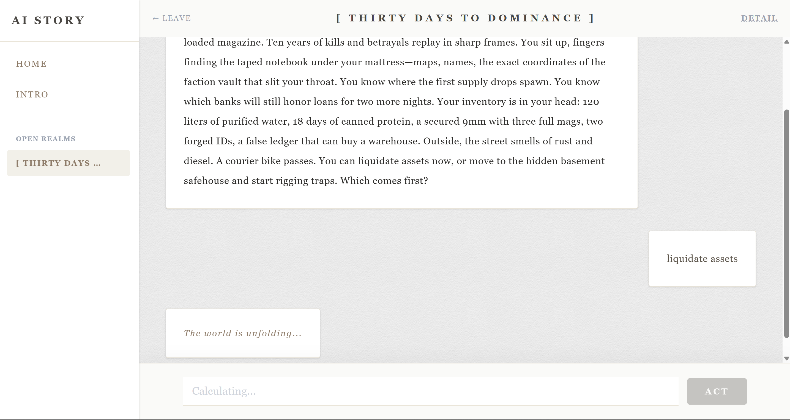
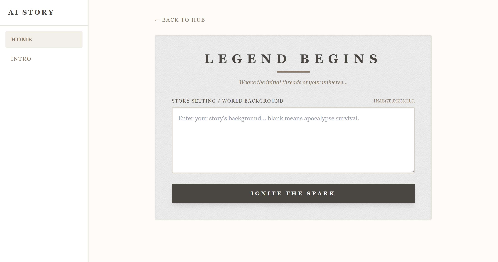
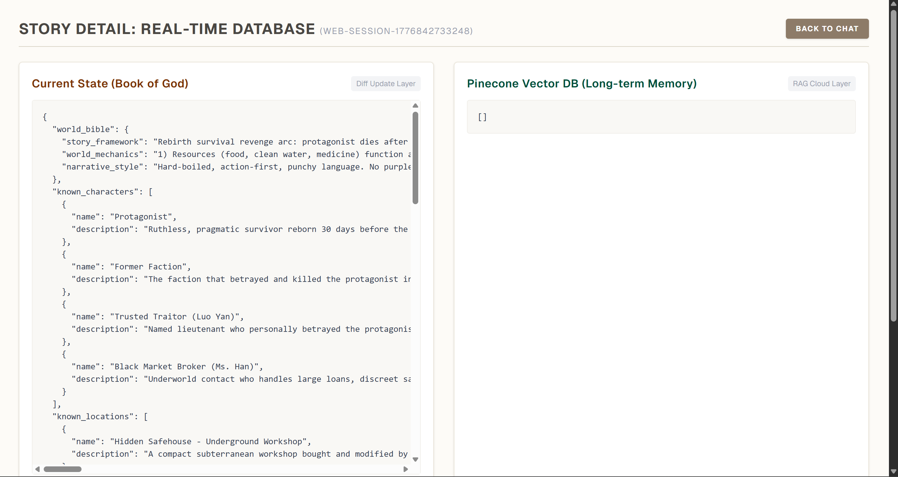
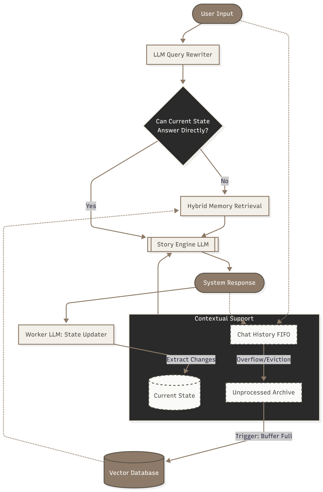

# 📖 Story AI — Infinite Narrative Engine with Agentic RAG

> An open-world text adventure that never forgets. Built on a dual-track memory architecture combining vector search, state machines, and intent-aware short-circuiting to maintain coherent narratives across thousands of turns.

**[Live Demo](https://story-ai-ray.vercel.app/)** · Next.js · LangChain.js · Pinecone · Upstash Redis · GPT-5-mini & GPT-4o-mini

## Screenshot

<div align="center">
  
</div>

<br />

<details>
  <summary><b>🔍 Check more screenshots (Home, New Universe, Detail)</b></summary>
  <p align="center">
    
    <br /><i>Universe Hub</i><br /><br />
    
    <br /><i>World Creation</i><br /><br />
    
    <br /><i>Global State Monitor</i>
  </p>
</details>

---

## The Core Problem

LLM-powered story games break down at scale. After ~20 turns, models forget earlier plot points. After ~100 turns, context windows overflow. After ~1000 turns, the world loses coherence entirely.

Naive RAG pipeline solve the context overflow problem but fail at exact object recall. Standard semantic similarity is often too "fuzzy" to reliably retrieve specific entities, leading to "entity drift" where critical plot objects vanish or transform.

This project is my attempt to engineer around all three failure modes simultaneously.

---

## Architecture: Dual-Track Parallel Memory

Rather than a single memory strategy, the system runs two independent tracks in parallel after every turn:

### Track 1 — Global State Machine

After the story generator LLM (gpt-5-mini) finishes generating a response, a background Worker LLM (gpt-4o-mini) runs independently of the main story generation. It reads the latest dialogue and extracts **only what changed** — a structured `StateDiff` validated against a Zod schema:

```typescript
// Example diff extracted after "I pick up the ancient sword"
{
  updated_character:[{name:"player",description:"A young man from the Shire holds the ancient sword"}],
  added_item:[{name:"Ancient Sword of Angles",description:"A magical sword made by angles that glows in the dark."}],
  inventory_added: ["Ancient Sword of Angles"],
  state_summary:"The player picked up the ancient sword of angles."
}
```

This diff is merged into `currentState` in Redis. The state table stays bounded regardless of play length, and every future generation gets the full world state as a constraint without any growing overhead.

**Why this matters:** Separating state extraction from story generation means the main LLM never has to "remember" facts — they're always injected as structured ground truth.

### Track 2 — Memory Lifecycle

Chat history is maintained as a FIFO queue in Redis. 

1. **Sliding Window** — recent turns are kept in memory for immediate context.
2. **Unprocessed Archive** — turns that overflow the sliding window are stored here.
3. **Semantic Chunking** — when the buffer hits threshold, text is split with **context overlap between chunks** to prevent semantic fragmentation at boundaries. Fed into LLM to generate a dense summary and entities involved in the chunk.
4. **Vectorization → Pinecone** — dense narrative embeddings stored with metadata (turn number, active quests, location).
5. **Retrieval** — when the player needs to recall past events, the system retrieves relevant chunks based on by metadata and semantic similarity and feed into the story generator LLM.

**Why this matters:** Separating memory into sliding window and long-term memory allows the system to maintain both immediate context and long-term coherence without overflowing the context window.

System Architecture Diagram:

<div align="center">
  
</div>
---

## Key Engineering Decisions

### Tiered Search (not just vector similarity)

Short player commands like "attack the guard" don't embed well — they lack semantic richness. Pure vector search returns noisy, loosely-related memories.

Step 1: Query Enhancement
- Expansion: Converts telegraphic commands into descriptive sentences to improve embedding quality.
- De-reference: Replaces pronouns with actual entity names.
- Entity extraction: Extracts entities from the query to improve metadata filtering.

Step 2: Tiered Search 
- Tier 1: `metadata-filtered vector search` — The system first queries Pinecone with a metadata filter requiring at least one entity identified by the rewriter. This forces the retrieval to stay anchored to the current scene, location, or involved NPCs.
- Tier 2: `unconstrained fallback search` — Concurrently, the system performs a broad semantic sweep without metadata constraints.

If Tier 1's result doesn't meet the threshold, the system will deduplicate the results from Tier 1 and Tier 2 and merge them.

**Why this matters:** multi-tier search ensures both precision and recall, solving the short-query retrieval problem.

**Why not hybrid search (BM25+RRF)?**
-  Key entities appear frequently across almost every story turn. This causes IDF weights to lose their effectiveness. BM25 fails to accurately rank the most relevant plot points.
-  Reciprocal Rank Fusion (RRF) is only effective when both retrieval paths provide reliable, independent signals. In a narrative environment where keyword scores are flat, fusing them with high-quality vector results would simply dilute the precision of the dense embeddings
-  Hybrid search adds latency and complexity without significant benefit in this domain.

### Intent Short-Circuit

Before any retrieval, the system evaluates: *"Can the current UI state + recent history answer this without going to the DB?"*

Simple actions like drawing a sword, checking inventory, or repeating a known location don't need vector search. Skipping it eliminates 200–400ms of latency on ~30% of turns.

**Trade-off acknowledged:** This requires accurate intent classification. A false positive (incorrectly short-circuiting a turn that actually needed memory) produces plot inconsistencies. Current threshold is conservative.

### LLM Selection Rationale

| Role | Model | Reason |
|------|-------|--------|
| Story Writer | gpt-5-mini | Capability in story generation, long-context narrative coherence, fast streaming, cost-efficient |
| State Worker | gpt-4o-mini | Even cheaper than gpt-5-mini, and reliable structured JSON output via native JSON mode |

---

## Known Limitations & What I'd Build Next

I documented these honestly because I think identifying architectural ceilings is as important as building the system.

**Current issue 1:** Results from Tier 1 and Tier 2 search are assigned equal significance in the final prompt. In practice, their actual relevance to the player's immediate intent can vary significantly, sometimes introducing narrative noise that distracts the writer model.

**Next: Agentic RAG with Document Grading**
Introduce a self-reflection loop post-retrieval: a fast grading model evaluates each retrieved chunk's relevance before it enters the prompt. Active filtering instead of passive retrieval.

> ⚠️ **Risk:** An intermediate grading LLM adds ~150–300ms TTFT. For a real-time game, that's meaningful. Possible mitigation: run grading only when retrieval confidence score is below a threshold, not on every turn.

**Current issue 2:** Current state table is a global table, which can lead to a large state table as the number of turns increases. 

**Next: State Hydration on Demand**
Spatial state decoupling — only hydrate sub-states relevant to the player's current scene or active event, not the full world state on every call.

> ⚠️ **Risk:** It's hard to distinguish whether a state is relevant to the the scene. Some items may have a hidden-trigger linked to a world state in a far-off region. Moreover, to know what sub-states are relevent, the system must first understand the player intent. However, to fully comprehand the intent, the LLM often requires the context provided by those sub-states. This creates a chicken-and-egg problem.

---

## Tech Stack

| Layer | Technology |
|-------|-----------|
| Frontend | Next.js (App Router), React, Tailwind CSS |
| Backend | Serverless Node.js with streaming |
| AI Orchestration | LangChain.js |
| State & Cache | Upstash Redis |
| Long-term Memory | Pinecone Vector DB |
| Validation | Zod schema |

---

## Running Locally

```bash
git clone https://github.com/YOUR_USERNAME/story-ai
cd story-ai
npm install

# Set up environment variables
cp .env.example .env.local
# Add: OPENAI_API_KEY, PINECONE_API_KEY, UPSTASH_REDIS_REST_URL, UPSTASH_REDIS_REST_TOKEN

npm run dev
```

---

## What I Learned

Building this forced me to think carefully about **token budget as a first-class engineering constraint** — every architectural decision (state diffs instead of full state, sliding window instead of full history, short-circuit before retrieval) was made to reduce tokens per request without sacrificing coherence.

The biggest insight: **memory in LLM systems isn't a storage problem, it's a retrieval precision problem.** Having the right context matters more than having all the context.
